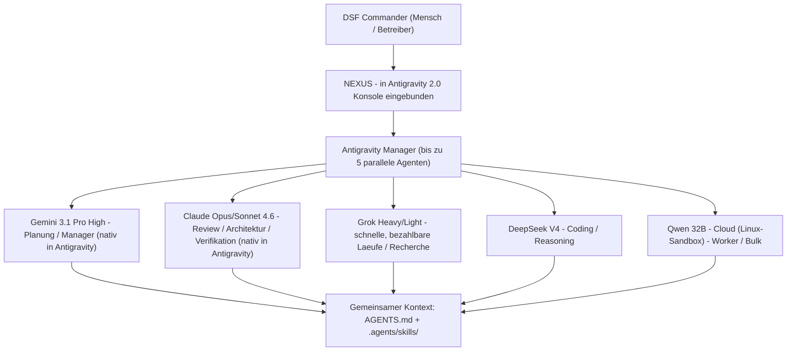

# DSF Agenten-Schwarm - Gesamtbild

Dieses Dokument beschreibt den Multi-Modell-Agenten-Schwarm der DSF-Umgebung.
Es liegt bewusst unter `.agents/`, weil sowohl **Grok Build** als auch
**Google Antigravity** diesen Ordner (und `AGENTS.md`) lesen - so kennt jedes
Tool dasselbe Gesamtbild, ohne dass etwas doppelt gepflegt werden muss.

Prinzip: **keep it simple, es muss laufen.** Eine einzige Quelle der Wahrheit
(`AGENTS.md` + `.agents/skills/`), von allen Modellen geteilt.

## Rollen

Der **DSF Commander ist ein Mensch** (der Betreiber). Die KI-Modelle arbeiten
als Schwarm unter seiner Leitung. **NEXUS** ist das System des Betreibers und
ist in die **Antigravity-Entwicklerkonsole** eingebunden (kein eigenes
Frontend - bewusst, um Fehlerquellen zu vermeiden).

## Modell-Roster (Vorschlag, frei anpassbar)

| Modell | Wo | Vorgeschlagene Rolle | Warum |
| :--- | :--- | :--- | :--- |
| Gemini 3.1 Pro High | Antigravity (nativ) | Planung / Manager | Starke Planung, nativer Manager-View |
| Claude Opus/Sonnet 4.6 | Antigravity (nativ) | Review / Architektur / Verifikation | Gruendliche Analyse, saubere Diffs |
| Grok Heavy/Light | Grok Build / API | Schnelle Laeufe, Recherche | Bezahlbar, schnell |
| DeepSeek V4 | Cloud / API | Coding / Reasoning | Kostenguenstiges Reasoning |
| Qwen 32B | Cloud, Linux-Sandbox | Worker / Bulk | Guenstige Massen-Ausfuehrung |

Die Rollenverteilung ist ein Startpunkt - im Antigravity Manager kann pro
Aufgabe das passende Modell gewaehlt werden.

## So bindet sich Claude in Antigravity ein

1. Antigravity IDE oeffnen, **Manager-View**.
2. **Neuen Agenten spawnen** -> Workspace = dieses Repository waehlen.
3. **Modell = Claude (Opus 4.6 oder Sonnet 4.6)** waehlen.
4. Antigravity mountet automatisch `AGENTS.md` und `.agents/skills/` in die
   Sandbox - der Claude-Agent hat damit sofort Projektkontext und den
   `dsf-system-inspection`-Skill.
5. Bis zu 5 Agenten (z. B. Claude + Gemini + Qwen) parallel laufen lassen und
   im Manager ueberwachen.

## Gemeinsame Bausteine

| Baustein | Datei | Gelesen von |
| :--- | :--- | :--- |
| Projekt-Instructions | `AGENTS.md` | Grok Build, Antigravity |
| Skills | `.agents/skills/<name>/SKILL.md` | Grok Build, Antigravity |
| Grok-spezifische Config | `.grok/settings.json`, `~/.grok/user-settings.json` | Grok Build |
| Machine-Bootstrap | `scripts/grok-bootstrap.ps1` | manuell (Windows ARM64) |
| State/Persistenz/Zero-Trust | `.agents/state/STATE_CONTRACT.md` (+ Schema/Beispiel) | alle Agenten (gemeinsames Journal) |

NEXUS bleibt unveraendert - diese Dateien beschreiben nur den Agenten-Kontext.
