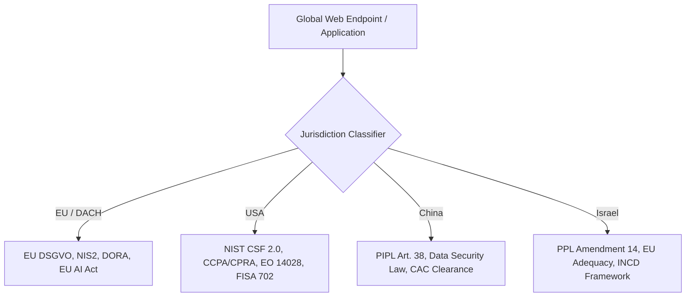

# 🌐 Global Compliance & Cyber Defense Matrix 2026
### Multi-Jurisdictional Privacy & Supply Chain Architecture: EU vs. USA vs. China vs. Israel

> **Version:** 2026.1  
> **Classification:** Technical & Regulatory Whitepaper  
> **Author:** DSF Consulting / AirFun1311  
> **Alignment:** GitHub Supply Chain Security, OpenSSF, NIST CSF 2.0, ISO/IEC 27001:2022

---

## 1. Executive Summary

As of **2026**, global compliance has shifted from static checkbox policies to **continuous automated verification**, **software supply chain provenance (SBOM)**, and **cross-border data transfer telemetry**. 

The **DSF Compliance Engine** models risks dynamically across four major regulatory and cyber spheres:



---

## 2. Deep-Dive Comparative Matrix (2026 State of the Art)

| Vector / Standard | 🇪🇺 European Union (DACH) | 🇺🇸 United States | 🇨🇳 People's Republic of China | 🇮🇱 State of Israel |
| :--- | :--- | :--- | :--- | :--- |
| **Primary Data Privacy Law** | **GDPR / DSGVO** (Regulation EU 2016/679) | **CCPA / CPRA**, State Privacy Acts, HIPAA | **PIPL** (Personal Information Protection Law) | **PPL 5741-1981** & **Amendment 14 (2024–2026)** |
| **Cybersecurity Baseline** | **NIS2** (Dir. EU 2022/2555), **DORA** | **NIST CSF 2.0**, CMMC 2.0, CISA Directives | **Cybersecurity Law (CSL)**, Multi-Level Protection Scheme (MLPS 2.0) | **INCD Defense Doctrine**, Privacy Protection Regulations 5777-2017 |
| **Supply Chain & SBOM Mandate** | CRA (Cyber Resilience Act) & ISO 27001:2022 | **Executive Order 14028** (SPDX/CycloneDX SBOM) | Strict supply-chain national security review (CAC) | INCD Certified Cyber Resilience Baselines |
| **Cross-Border Transfer Mechanism** | Adequacy, EU-US DPF, SCCs + TIA (Schrems II) | Cross-Border Privacy Rules (CBPR), DPF | **CAC Security Assessment**, Standard Contracts | **EU Adequacy Decision**, PPL Transfer Regulations |
| **Extraterritorial Access / Risk** | Strictest privacy bar, Cloud Sovereignty | **Cloud Act**, Section 702 FISA (Gov access) | **Data Security Law (DSL)** - Critical Data Localization | Israeli Court Orders, PPA Regulatory Oversight |
| **Incident Reporting Window** | **24h Early Warning / 72h Final** (NIS2 / DSGVO) | 24h (CISA CIRCIA) / 72h (SEC 8-K) | Immediate / 8h to CAC / Sector Regulators | Prompt notification to PPA & INCD |

---

## 3. GitHub Supply Chain Whitepaper Alignment

According to the official **GitHub Security Whitepapers** and the **OpenSSF (Open Source Security Foundation)**, enterprise repositories in 2026 must adhere to the **SLSA (Supply-chain Levels for Software Artifacts)** framework:

```
[Level 1: Build Process] ➔ [Level 2: Hosted Source & Version Control] ➔ [Level 3: Hermetic Builds & Automated SBOM]
         ✅ Git History                  ✅ GitHub Actions CI                      ✅ SPDX / CycloneDX + CodeQL SAST
```

### Implemented Controls in DSF-Engine:
1. **Automated Static Application Security Testing (SAST)**: GitHub CodeQL matrix scanning on all pull requests.
2. **Software Bill of Materials (SBOM)**: SPDX 2.3 standard export tracking all upstream transitive dependencies.
3. **Automated Vulnerability Management**: GitHub Dependabot with weekly automated PRs and strict version locking.
4. **Secret Scanning & Fail-Closed Validation**: Zero trust runtime prevents leakage of sensitive tokens.

---

## 4. Geopolitical Endpoint Classification in DSF Scanner

When the scanner discovers external network calls, third-party scripts, or fonts, it assigns an automated **Geopolitical Risk Weight**:

```text
[EU / EEA Endpoint]       ➔ LOW RISK (GDPR-native processing)
[Israel (Adequate)]       ➔ LOW/MEDIUM RISK (Recognized under EU Adequacy + PPL Protection)
[USA (Commercial/DPF)]    ➔ MEDIUM/HIGH RISK (Subject to FISA 702 / US Cloud Act risk assessment)
[China / Non-Adequate]    ➔ CRITICAL RISK (Mandatory cross-border consent & CAC assessment trigger)
```

---

## 5. Technical Implementation in Python Core

The classification logic operates at the network and header inspection layer:
* **SSL/TLS Protocol Validation**: Prohibits TLS < 1.3, weak cipher suites, and invalid X.509 chains.
* **Font Leakage Zero-Tolerance**: Flags unauthorized requests to Google Fonts or Adobe Typekit servers that transmit client IP data across borders.
* **Security Headers Mandatory Suite**: HSTS (max-age >= 31536000), CSP (Content-Security-Policy), X-Frame-Options: DENY, and Referrer-Policy: strict-origin-when-cross-origin.

---

*(c) 2026 DSF Consulting | AF13-NEXUS | Enterprise Compliance & Security Architecture*
