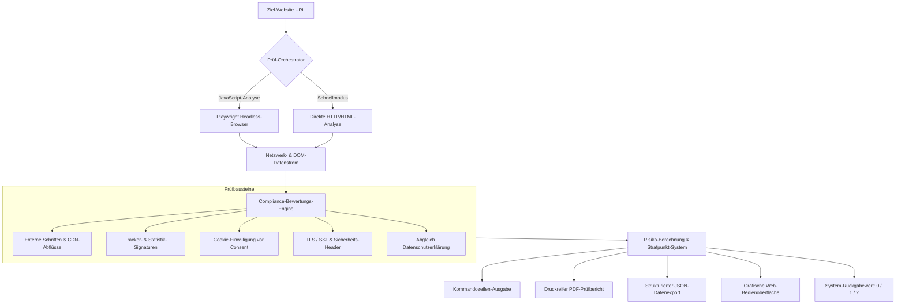

<div align="center">

# DSGVO-Checker

### Webseiten prüfen. Risiken finden. Abmahnungen verhindern.
**Automatische Datenschutz- und Sicherheitsanalyse für Unternehmen, Handwerk & Webagenturen.**


[](https://github.com/AirFun1311/dsgvo-checker/actions)
[](https://github.com/AirFun1311/dsgvo-checker/actions)
[](https://github.com/AirFun1311/dsgvo-checker/releases)
[](https://github.com/AirFun1311/dsgvo-checker/actions)
[](https://slsa.dev/)
[](https://spdx.dev/)
[](https://www.python.org/)
[](Dockerfile)
[](LICENSE)

<p align="center">
  <strong>1 Klick. 10 Sekunden. Volle Klarheit.</strong><br>
  Prüft jede Website sofort auf Google-Fonts-Abflüsse, unzulässige Cookies vor Einwilligung (§ 25 TDDDG) und fehlende Verschlüsselung (Art. 32 DSGVO).
</p>

[Schnellstart](#schnellstart) • [Preise & Lizenzen](#lizenzierung--preise) • [Funktionsweise](#funktionsweise--architektur) • [Kommandozeile](#kommandozeilen-schnittstelle-cli)

</div>


---

## Lizenzierung & Konditionen (Source-Available)

> **Entwickelt für den deutschen Mittelstand, IT-Dienstleister & Betriebe.**  
> In diese Prüf-Engine sind monatelange intensive Recherche, deutsche Gesetzestexte (DSGVO, § 25 TDDDG, BSI-Standards, EU AI Act 2026) und praxiserprobte Ingenieursarbeit eingeflossen.  
> 
> Um eine dauerhafte Pflege, juristische Aktualität und technische Weiterentwicklung zu gewährleisten, wird diese Software als **Source-Available Commercial Software** lizenziert. Jede Nutzung unterliegt einer fairen, transparenten Lizenzierung.

### Übersicht der Lizenzmodelle

| Lizenz / Modell | Zielgruppe & Berechtigung | Preis | Bezugsweg |
| :--- | :--- | :---: | :--- |
| **Persönlich / Ausbildung & Forschung** | Für Einzelpersonen, Studenten & Forscher zur persönlichen Weiterbildung & internen Analyse. | **29 €** *(einmalig)* | Per E-Mail / Rechnung |
| **Gewerblich Einzel-Domain** | Für 1 Unternehmen / Selbstständigen zur eigenständigen Prüfung & Absicherung der eigenen Firmen-Domain. | **129 €** *(einmalig)* | Per E-Mail / Rechnung |
| **Agenturen & IT-Berater Pro** | Für Webagenturen & IT-Dienstleister. Unbegrenzte Scans für Kunden-Websites inklusive druckreifem PDF-Export. | **390 €** *(einmalig)* | Per E-Mail / Rechnung |
| **Komplettservice Prüfbericht** | Vollständiges Turnkey-Audit durch den Entwickler inklusive geprüftem 10-seitigen PDF-Bericht für Ihre Unterlagen. | **190 €** *(pro Domain)* | Per E-Mail / Rechnung |

**Lizenzanfragen & offizielle Rechnung (mit USt.):**  
Bestellungen und Autorisierungsanfragen richten Sie bitte formlos per E-Mail an: `sf.foodzeit@googlemail.com`  
*(Zahlung flexibel per Banküberweisung, PayPal oder Stripe. Ausgewiesene Rechnung & Lizenzzertifikat werden direkt ausgestellt.)*

---

## Technische Leistungsmerkmale

* **Zwei-Stufen-Prüfverfahren**: Vollständige Browser-Automatisierung (Playwright / Chromium) zur Erfassung dynamischer JavaScript-Tracker kombiniert mit schnellem HTTP-Ausweichverfahren.
* **Drittanbieter- & Tracker-Erkennung**: Kontinuierlicher Abgleich gegen über 50 bekannte Werbenetzwerke, Statistikdienste, Sitzungsaufzeichner und Telemetrie-Endpunkte.
* **Prüfung externer Schriften**: Automatische Erkennung nicht-eingewilligter Serveraufrufe (z.B. Google Fonts, Adobe Typekit) gemäß deutscher Rechtsprechung (*LG München I, Az. 3 O 17493/20*).
* **Verschlüsselungs- & Sicherheits-Audit**: Überprüfung von TLS-Protokollen, Zertifikatslaufzeiten, HSTS, Content Security Policy (CSP), X-Frame-Options und Referrer-Richtlinien.
* **Speicher- & Cookie-Prüfung**: Echtzeit-Erfassung von Cookies und Speicherzugriffen, die vor einer aktiven Nutzereinwilligung gesetzt werden (§ 25 TDDDG).
* **Druckreifer PDF-Export**: Erzeugung professioneller, strukturierter Vektor-PDF-Berichte mit ReportLab für Prüfer, Kunden und Aufsichtsbehörden.
* **Automatische Schwellenwerte**: Definierbare Abbruchkriterien (`--fail-on-risk`, `--fail-on-high`) zur direkten Einbindung in Entwicklungs- und Freigabeprozesse.

---

## Funktionsweise & Architektur



---

## Schnellstart

### 1. Grafische Web-Bedienoberfläche starten (Docker)

Startet die Web-Oberfläche direkt auf Port 8501:

```bash
docker run -d -p 8501:8501 --name dsgvo-checker ghcr.io/airfun1311/dsgvo-checker:latest
```

Die Bedienoberfläche ist anschließend unter `http://localhost:8501` im Browser erreichbar.

---

### 2. Lokale Installation (Python)

```bash
# Repository herunterladen
git clone https://github.com/AirFun1311/dsgvo-checker.git
cd dsgvo-checker

# Virtuelle Python-Umgebung einrichten
python -m venv .venv

# Umgebung aktivieren:
# Linux / macOS:
source .venv/bin/activate
# Windows (PowerShell):
.\.venv\Scripts\Activate.ps1

# Abhängigkeiten installieren
pip install -r requirements.txt

# (Optional) Browser für dynamische JavaScript-Prüfung installieren:
playwright install chromium
```

---

## Kommandozeilen-Schnittstelle (CLI)

Prüfungen direkt im Terminal durchführen:

```bash
# Einfache Prüfung mit Terminal-Ausgabe
python run_scan.py https://beispiel-firma.de

# Vollständiges Audit: Erzeugt druckreifen PDF-Bericht und JSON-Rohdaten
python run_scan.py https://beispiel-firma.de --pdf --json -o ./berichte/

# Schnelle Vorprüfung ohne Browser-Engine
python run_scan.py https://beispiel-firma.de --no-js --pdf
```

### Übersicht der Kommandozeilen-Parameter

| Parameter | Typ | Beschreibung |
| :--- | :--- | :--- |
| `url` | `Text` | Ziel-URL der zu prüfenden Website *(Pflichtangabe)* |
| `--pdf` | `Schalter` | Erzeugt einen druckreifen PDF-Prüfbericht |
| `--json` | `Schalter` | Exportiert alle Prüfdaten als maschinenlesbare JSON-Datei |
| `--no-js` | `Schalter` | Deaktiviert die Browser-Engine (schneller HTTP-Modus) |
| `-o`, `--output-dir` | `Pfad` | Zielverzeichnis für generierte Berichte *(Standard: `. /`)* |
| `--fail-on-risk` | `Zahl` | Beendet mit Fehlercode `1`, wenn der Risikowert $\ge$ Schwellenwert ist (0–100) |
| `--fail-on-high` | `Schalter` | Beendet mit Fehlercode `1`, wenn mindestens ein schwerer Verstoß vorliegt |
| `-q`, `--quiet` | `Schalter` | Unterdrückt Textausgaben (ideal für automatische Hintergrundläufe) |

---

## Gesetzliche Prüfungsbereiche

Alle technischen Auswertungen sind direkt den geltenden deutschen und europäischen Rechtsnormen zugeordnet:

| Prüfbereich | Gesetzliche Grundlage | Schweregrad | Technische Auswirkung |
| :--- | :--- | :--- | :--- |
| **Externe Schriften / CDNs** | Art. 44 ff. DSGVO, *LG München I (3 O 17493/20)* | **HOCH** | Unzulässige Übermittlung von IP-Adressen an US-Server ohne Einwilligung |
| **Cookies vor Einwilligung** | § 25 Abs. 1 TDDDG, Art. 6 Abs. 1 lit. a DSGVO | **HOCH** | Unzulässiges Setzen von Identifikatoren vor aktiver Nutzerauswahl |
| **Transportverschlüsselung** | Art. 32 Abs. 1 lit. a DSGVO | **KRITISCH** | Unverschlüsselte Klartextübertragung personenbezogener Daten |
| **Sicherheits-Header (HSTS/CSP)** | Art. 32 Abs. 1 lit. b DSGVO (TOMs) | **MITTEL** | Fehlende serverseitige Härtung gegen Manipulation und Abfangen |
| **Vollständigkeit Rechtstexte** | Art. 12, 13 DSGVO | **MITTEL** | Fehlende oder unzureichende Pflichtangaben zu eingesetzten Diensten |

---

## Qualitätssicherung & Testberichte

Das Projekt unterliegt strenger kontinuierlicher Qualitätskontrolle:

```bash
# Alle 16 automatisierten Tests ausführen
pytest tests/ -v

# Code-Stil und Formatierung prüfen
ruff check .
ruff format --check .

# Statische Sicherheitsanalyse durchführen
bandit -r . -ll -ii
```

---

## Kontakt & Impressum

* **Entwickler & Inhaber**: DSF Consulting / AirFun1311  
* **Standort**: Fürth / Metropolregion Nürnberg, Franken, Deutschland  
* **Lizenz- und Sicherheitsanfragen**: `sf.foodzeit@googlemail.com`  
* **Rechtlicher Hinweis**: Dieses System führt eine technische Bestandsaufnahme durch. Für rechtlich verbindliche Gutachten wird die Hinzuziehung eines zertifizierten Datenschutzbeauftragten oder Fachanwalts empfohlen.

---

<div align="center">
  <sub>Entwickelt mit deutscher Ingenieurs-Gründlichkeit • DSF Consulting • Fürth, Deutschland</sub>
</div>
