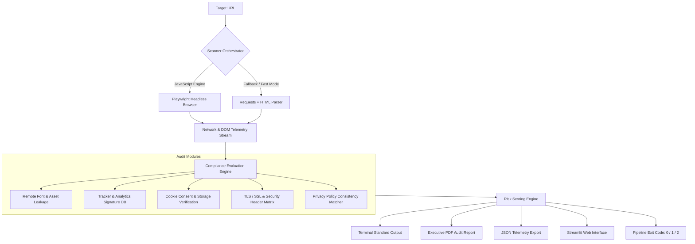

<div align="center">

# DSGVO / GDPR Compliance Verification Engine

### Automated Technical Audit System & Compliance Reporting Infrastructure

[](https://github.com/AirFun1311/dsgvo-checker/actions)
[](https://github.com/AirFun1311/dsgvo-checker/actions)
[](https://github.com/AirFun1311/dsgvo-checker/releases)
[](https://github.com/AirFun1311/dsgvo-checker/actions)
[](https://slsa.dev/)
[](https://spdx.dev/)
[](https://www.python.org/)
[](Dockerfile)
[](LICENSE)


<p align="center">
  <strong>Production-grade automated compliance scanner designed for German & European SMEs, DPOs, and DevSecOps pipelines.</strong><br>
  Performs deep inspections for GDPR/DSGVO non-compliance, unconsented third-party trackers, external font leakage, and cryptographic misconfigurations.
</p>

[Quickstart](#quickstart) • [Architecture](#system-architecture) • [CLI Security Gate](#command-line-interface-cli) • [Docker Deployment](#docker-deployment) • [Regulatory Standards](#legal--regulatory-standards)

</div>

---

## Technical Specifications & Capabilities

* **Dual-Engine Architecture**: Headless browser automation (Playwright / Chromium) for full JavaScript execution combined with high-throughput HTTP/DOM fallback analysis.
* **Third-Party Telemetry & Tracker Detection**: Continuous signature analysis against 50+ adtech networks, session recorders, tracking pixels, and analytics endpoints.
* **Dynamic Remote Asset & Font Audit**: Automatic identification of unconsented third-party asset calls (e.g., Google Fonts, Adobe Typekit) violating European jurisprudence (*LG Muenchen I, Az. 3 O 17493/20*).
* **Cryptographic & Header Verification**: Verification of TLS protocols, cipher suites, certificate validity, HSTS with preload, CSP policies, X-Frame-Options, and Referrer-Policy.
* **Storage & Consent Enforcement**: Real-time identification of cookies, local storage tokens, and tracking beacons placed prior to explicit user opt-in (§ 25 TDDDG).
* **Multi-Format Export Pipelines**:
  * Structured terminal output with granular risk metrics.
  * Audit-grade **vector PDF reports** generated via ReportLab.
  * Schema-validated **JSON exports** for SIEM and centralized telemetry pipelines.
  * Interactive **Streamlit Web Application** for on-demand auditing.
* **Automated CI/CD Quality Gates**: Configurable exit codes (`--fail-on-risk`, `--fail-on-high`) to prevent deployment of non-compliant web applications.

---

## System Architecture



---

## Quickstart

### 1. Docker Deployment (Recommended)

Run the containerized web interface on port 8501:

```bash
docker run -d -p 8501:8501 --name dsgvo-checker ghcr.io/airfun1311/dsgvo-checker:latest
```

Access the dashboard via `http://localhost:8501`.

---

### 2. Local Python Environment

```bash
# Clone the repository
git clone https://github.com/AirFun1311/dsgvo-checker.git
cd dsgvo-checker

# Initialize virtual environment
python -m venv .venv

# Activate:
# Linux / macOS:
source .venv/bin/activate
# Windows (PowerShell):
.\.venv\Scripts\Activate.ps1

# Install dependencies
pip install -r requirements.txt

# (Optional) Install Playwright Chromium for JavaScript analysis:
playwright install chromium
```

---

## Command Line Interface (CLI)

Run compliance scans directly from your terminal:

```bash
# Standard terminal scan
python run_scan.py https://example.com

# Comprehensive audit: Generate PDF and JSON reports
python run_scan.py https://example.com --pdf --json -o ./reports/

# Fast scan without JavaScript rendering
python run_scan.py https://example.com --no-js --pdf
```

### CLI Flag Reference

| Parameter | Type | Description |
| :--- | :--- | :--- |
| `url` | `string` | Target website URL to audit *(Required)* |
| `--pdf` | `flag` | Generate an audit-ready executive PDF report |
| `--json` | `flag` | Export complete telemetry to a machine-readable JSON file |
| `--no-js` | `flag` | Disable Playwright rendering (fast HTTP fallback mode) |
| `-o`, `--output-dir` | `path` | Output directory for generated artifacts *(Default: `.`)* |
| `--fail-on-risk` | `integer` | Exit with code `1` if risk score is $\ge$ threshold (0–100) |
| `--fail-on-high` | `flag` | Exit with code `1` if any high-severity violation is detected |
| `-q`, `--quiet` | `flag` | Minimal logging mode for automated pipelines |

---

## CI/CD Security Gate Integration

Integrate automated compliance verification into continuous integration workflows:

### GitHub Actions Pipeline Example

```yaml
name: Continuous DSGVO Compliance Gate

on:
  push:
    branches: [ main ]
  schedule:
    - cron: '0 3 * * 1' # Scheduled weekly audit

jobs:
  compliance-audit:
    runs-on: ubuntu-latest
    steps:
      - name: Checkout Code
        uses: actions/checkout@v4

      - name: Set up Python
        uses: actions/setup-python@v5
        with:
          python-version: "3.11"

      - name: Install Dependencies
        run: |
          pip install -r requirements.txt
          playwright install chromium

      - name: Execute Security Gate
        run: |
          python run_scan.py https://staging.example.com \
            --fail-on-risk 35 \
            --fail-on-high \
            --pdf \
            --json \
            -o ./audit-results/

      - name: Archive Compliance Artifacts
        if: always()
        uses: actions/upload-artifact@v4
        with:
          name: dsgvo-audit-reports
          path: ./audit-results/
```

### Process Exit Codes:
* `0`: **PASS** — Target system is compliant within acceptable risk parameters.
* `1`: **FAIL** — High-severity violations identified or risk threshold exceeded.
* `2`: **ERROR** — Network timeout, unreachable host, or fatal runtime exception.

---

## Docker Deployment

### Docker Compose Architecture

```bash
# Start Streamlit Web UI on port 8501
docker compose up -d web

# Execute a one-off headless scan inside Docker
docker compose run --rm cli https://example.com --pdf --json
```

---

## Legal & Regulatory Standards

Technical evaluations are mapped directly to European and German statutory requirements:

| Inspection Area | Statutory Anchor | Severity Level | Technical Implication |
| :--- | :--- | :--- | :--- |
| **External Fonts / CDNs** | Art. 44 ff. DSGVO, *LG Muenchen I (3 O 17493/20)* | **HIGH** | Unlawful transmission of IP addresses to third countries |
| **Pre-Consent Cookies** | § 25 TDDDG, Art. 6(1)(a) DSGVO | **HIGH** | Missing explicit prior consent for storage access |
| **Transport Layer Security** | Art. 32(1)(a) DSGVO | **CRITICAL** | Plaintext transmission of personal data |
| **Security Headers (HSTS/CSP)** | Art. 32(1)(b) DSGVO (TOMs) | **MEDIUM** | Missing technical protection against interception & XSS |
| **Privacy Policy Transparency** | Art. 12, 13 DSGVO | **MEDIUM** | Incomplete disclosure of tracking technologies |

---

## Quality Assurance & Testing

The codebase enforces strict code quality and comprehensive test coverage:

```bash
# Run pytest test suite
pytest tests/ -v

# Run linting and code formatting verification
ruff check .
ruff format --check .

# Run static application security testing (SAST)
bandit -r . -ll -ii
```

---

## Governance & Security

* **Contribution Workflow**: Review [CONTRIBUTING.md](CONTRIBUTING.md) for Conventional Commits and development setup.
* **Security & Vulnerability Disclosure**: Review [SECURITY.md](SECURITY.md) for reporting channels and response SLAs.
* **Code of Conduct**: Governed by [CODE_OF_CONDUCT.md](CODE_OF_CONDUCT.md).

---

## License

Distributed under the **MIT License**. See [`LICENSE`](LICENSE) for complete terms.

---

<div align="center">
  <sub>Maintained by <a href="https://github.com/AirFun1311">AirFun1311 / DSF Consulting</a> • Fuerth, Germany</sub>
</div>
