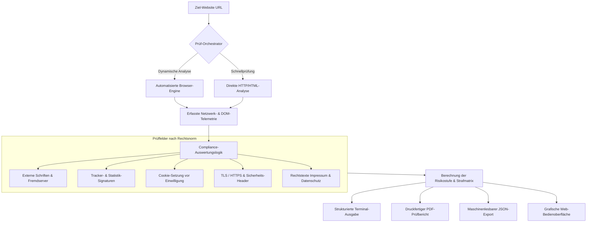

<div align="center">

# DSGVO-Checker

### Automatisierte Datenschutz- und Sicherheitsprüfung für Webseiten
**Präzise technische Bestandsaufnahme für Unternehmen, Datenschutzbeauftragte und Webagenturen**

[](https://github.com/AirFun1311/dsgvo-checker/actions)
[](https://github.com/AirFun1311/dsgvo-checker/actions)
[](https://github.com/AirFun1311/dsgvo-checker/releases)
[](https://github.com/AirFun1311/dsgvo-checker/actions)
[](https://slsa.dev/)
[](https://spdx.dev/)
[](https://www.python.org/)
[](Dockerfile)
[](LICENSE)

<p align="center">
  <strong>Deterministische und reproduzierbare Compliance-Prüfung für deutsche Webauftritte.</strong><br>
  Analysiert Webseiten automatisiert auf unzulässige Datenübertragungen (§ 25 TDDDG), unberechtigte Drittanbieter-Tracker, externe Schriftarten (LG München I) und technische Sicherheitsmängel (Art. 32 DSGVO).
</p>

[Schnellstart](#schnellstart) • [Lizenzmodelle & Preise](#lizenzmodelle--preise) • [Technische Leistungsmerkmale](#technische-leistungsmerkmale) • [Rechtliche Prüffelder](#rechtliche-pr%C3%BCffelder--gesetzesabgleich) • [Kommandozeile](#kommandozeilen-schnittstelle-cli)

</div>

---

## Lizenzmodelle & Preise

> **Professionelle Prüf-Software für den deutschen Mittelstand.**  
> In dieses System sind monatelange juristische und technische Recherchen aktueller Rechtsnormen (DSGVO, § 25 TDDDG, BSI-Standards) sowie praxiserprobte Software-Architektur eingeflossen.  
> 
> Um eine kontinuierliche Pflege, rechtliche Aktualität und technische Weiterentwicklung sicherzustellen, wird diese Software unter einem transparenten Lizenzmodell bereitgestellt:

### Übersicht der Lizenzmodelle

| Lizenzmodell | Berechtigung & Einsatzbereich | Vergütung | Bezugsweg |
| :--- | :--- | :---: | :--- |
| **Persönliche Lizenz** | Für Einzelpersonen, Studierende und Forschung zur persönlichen Weiterbildung & privaten Analyse. | **29 €** *(einmalig)* | Per E-Mail / Rechnung |
| **Gewerbliche Einzel-Lizenz** | Für 1 Unternehmen / Selbstständigen zur eigenständigen und dauerhaften Prüfung der eigenen Domain. | **129 €** *(einmalig)* | Per E-Mail / Rechnung |
| **Agentur- & Berater-Lizenz** | Für Webagenturen, Systemhäuser und IT-Berater. Unbegrenzte Mandanten-Prüfungen inklusive PDF-Export. | **390 €** *(einmalig)* | Per E-Mail / Rechnung |
| **Individueller Audit-Service** | Durchführung der vollständigen technischen Prüfung durch den Entwickler inklusive verifiziertem PDF-Bericht. | **190 €** *(pro Domain)* | Per E-Mail / Rechnung |

**Bestellungen & Rechnungsstellung (mit ausgewiesener Mehrwertsteuer):**  
Richten Sie Ihre Lizenzanfrage bitte formlos per E-Mail an: `sf.foodzeit@googlemail.com`  
*(Zahlung per Banküberweisung, PayPal oder Kreditkarte. Sie erhalten eine ordnungsgemäße Rechnung sowie ein offizielles Lizenzzertifikat.)*

---

## Technische Leistungsmerkmale

* **Vollständige Browser-basierte Analyse**: Simuliert einen echten Webseitenbesuch über eine automatisierte Browser-Engine (Playwright / Chromium) zur lückenlosen Erkennung dynamischer Skripte, Werbenetzwerke und Session-Recorder.
* **Prüfung externer Schriften & CDNs**: Erkennt unzulässige Serververbindungen zu Drittstaaten (z. B. Google Fonts, Adobe Typekit) gemäß der Rechtsprechung des *LG München I (Az. 3 O 17493/20)*.
* **Verschlüsselungs- & Sicherheits-Audit**: Überprüft Transportverschlüsselung (TLS), Zertifikatsgültigkeit, HSTS mit Preload sowie serverseitige Sicherheits-Header (CSP, X-Frame-Options, Referrer-Policy) nach Art. 32 DSGVO.
* **Einwilligungs- & Cookie-Erkennung**: Identifiziert Cookies und Web-Storage-Zugriffe, die vor einer ausdrücklichen und informierten Nutzereinwilligung gesetzt werden (§ 25 Abs. 1 TDDDG).
* **Prüffähige Berichterstellung**: Erzeugt strukturierte, druckfertige PDF-Prüfberichte für Geschäftsführung, Kunden und Dokumentationspflichten sowie JSON-Daten für automatisierte Schnittstellen.
* **Integrierte Qualitäts-Schwellenwerte**: Konfigurierbare Abbruchkriterien (`--fail-on-risk`, `--fail-on-high`) zur automatischen Fehlerüberwachung in Entwicklungs- und Freigabeprozessen.

---

## Systemarchitektur & Ablauf



---

## Schnellstart

### 1. Grafische Web-Bedienoberfläche starten (Docker)

Startet die Web-Oberfläche auf Port 8501:

```bash
docker run -d -p 8501:8501 --name dsgvo-checker ghcr.io/airfun1311/dsgvo-checker:latest
```

Die Bedienoberfläche ist anschließend unter `http://localhost:8501` im Webbrowser erreichbar.

---

### 2. Lokale Installation (Python)

```bash
# Quellcode herunterladen
git clone https://github.com/AirFun1311/dsgvo-checker.git
cd dsgvo-checker

# Virtuelle Python-Umgebung einrichten
python -m venv .venv

# Umgebung aktivieren:
# Linux / macOS:
source .venv/bin/activate
# Windows (PowerShell):
.\.venv\Scripts\Activate.ps1

# Abhängigkeiten installieren
pip install -r requirements.txt

# Browser-Komponente für JavaScript-Prüfung installieren:
playwright install chromium
```

---

## Kommandozeilen-Schnittstelle (CLI)

Prüfungen direkt über das Terminal ausführen:

```bash
# Standard-Prüfung mit Terminal-Ausgabe
python run_scan.py https://beispiel-unternehmen.de

# Vollständiges Audit: Erzeugt PDF-Prüfbericht und JSON-Datenexport
python run_scan.py https://beispiel-unternehmen.de --pdf --json -o ./berichte/

# Schnelle Vorprüfung ohne Browser-Engine
python run_scan.py https://beispiel-unternehmen.de --no-js --pdf
```

### Übersicht der Befehlsparameter

| Parameter | Typ | Beschreibung |
| :--- | :--- | :--- |
| `url` | `Text` | Ziel-URL der zu prüfenden Webseite *(Pflichtangabe)* |
| `--pdf` | `Schalter` | Erzeugt einen druckfertigen PDF-Prüfbericht |
| `--json` | `Schalter` | Exportiert alle Prüfergebnisse als strukturierte JSON-Datei |
| `--no-js` | `Schalter` | Führt die Prüfung im schnellen HTTP-Modus ohne Browser aus |
| `-o`, `--output-dir` | `Pfad` | Zielverzeichnis für generierte Berichte *(Standard: `. /`)* |
| `--fail-on-risk` | `Zahl` | Beendet mit Rückgabewert `1`, wenn der Risikowert $\ge$ Schwellenwert ist (0–100) |
| `--fail-on-high` | `Schalter` | Beendet mit Rückgabewert `1`, wenn mindestens ein schwerer Verstoß vorliegt |
| `-q`, `--quiet` | `Schalter` | Unterdrückt Textausgaben (geeignet für automatisierte Hintergrundläufe) |

---

## Rechtliche Prüffelder & Gesetzesabgleich

Die technischen Prüfungen sind direkt den geltenden deutschen und europäischen Rechtsnormen zugeordnet:

| Prüfbereich | Gesetzliche Grundlage | Schweregrad | Technische Relevanz |
| :--- | :--- | :--- | :--- |
| **Externe Schriftarten / CDNs** | Art. 44 ff. DSGVO, *LG München I (3 O 17493/20)* | **HOCH** | Unzulässige Übermittlung von IP-Adressen an Drittstaaten ohne Einwilligung |
| **Cookies & LocalStorage** | § 25 Abs. 1 TDDDG, Art. 6 Abs. 1 lit. a DSGVO | **HOCH** | Speichern und Auslesen von Nutzerdaten vor aktiver Einwilligung |
| **Transportverschlüsselung** | Art. 32 Abs. 1 lit. a DSGVO | **KRITISCH** | Fehlende oder veraltete HTTPS/TLS-Verschlüsselung bei Datenübertragungen |
| **Sicherheits-Header (HSTS/CSP)** | Art. 32 Abs. 1 lit. b DSGVO (TOMs) | **MITTEL** | Fehlende serverseitige Absicherung gegen Manipulation und Abfangen |
| **Transparenz der Rechtstexte** | Art. 12, 13 DSGVO | **MITTEL** | Unvollständige Angaben oder fehlende Datenschutzerklärung / Impressum |

---

## Software-Qualitätssicherung & Tests

Das System wird vor jeder Veröffentlichung automatisiert auf Funktionalität und Richtigkeit geprüft:

```bash
# Alle 16 automatisierten Tests ausführen
pytest tests/ -v

# Einhaltung von Quellcode- und Formatierungsstandards prüfen
ruff check .
```

---

## Betreiber & Kontakt

* **Entwickler & Inhaber**: DSF Consulting / AirFun1311  
* **Standort**: Fürth / Metropolregion Nürnberg, Deutschland  
* **Lizenz- und Prüfanfragen**: `sf.foodzeit@googlemail.com`  
* **Hinweis**: Dieses System führt eine technische Bestandsaufnahme durch. Es ersetzt keine individuelle juristische Beratung durch einen Fachanwalt oder zertifizierten Datenschutzbeauftragten.

---

<div align="center">
  <sub>Entwickelt für den deutschen Mittelstand • DSF Consulting • Fürth, Deutschland</sub>
</div>
