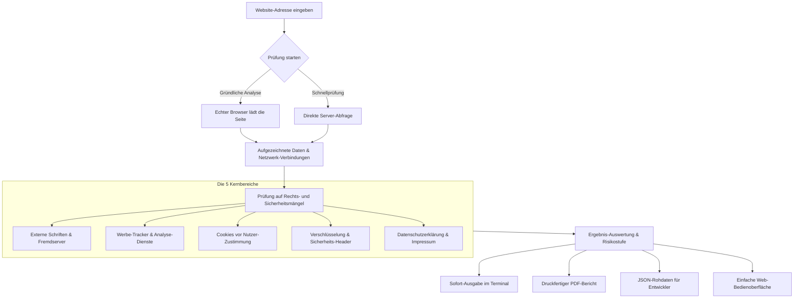

<div align="center">

# DSGVO-Checker

### Webseiten prüfen. Risiken finden. Abmahnungen verhindern.
**Die automatische Datenschutz- und Sicherheitsprüfung für Unternehmen, Handwerk & Webagenturen.**

[](https://github.com/AirFun1311/dsgvo-checker/actions)
[](https://github.com/AirFun1311/dsgvo-checker/actions)
[](https://github.com/AirFun1311/dsgvo-checker/releases)
[](https://github.com/AirFun1311/dsgvo-checker/actions)
[](https://slsa.dev/)
[](https://spdx.dev/)
[](https://www.python.org/)
[](Dockerfile)
[](LICENSE)

<p align="center">
  <strong>1 Klick. 10 Sekunden. Volle Klarheit.</strong><br>
  Prüft jede Website sofort auf Google-Fonts-Abflüsse, unzulässige Cookies vor Einwilligung (§ 25 TDDDG) und fehlende Verschlüsselung (Art. 32 DSGVO).
</p>

[Schnellstart](#schnellstart) • [Preise & Lizenzen](#preise--lizenzen) • [Was das System kann](#was-das-system-kann) • [Kommandozeile](#einfache-bedienung-im-terminal)

</div>

---

## Preise & Lizenzen

> **Ehrliche Software für den deutschen Mittelstand.**  
> In dieses Prüfprogramm sind monatelange Recherche der aktuellen Rechtslage (DSGVO, § 25 TDDDG, BSI-Vorgaben) und solide Programmierarbeit eingeflossen.  
> 
> Damit das System stets aktuell bleibt und weiter gepflegt wird, ist die Nutzung fair und transparent bepreist:

### Übersicht der Lizenzmodelle

| Lizenz | Für wen gedacht? | Preis | Bezugsweg |
| :--- | :--- | :---: | :--- |
| **Persönlich / Lernen & Forschung** | Für Einzelpersonen & Studenten zum Lernen und für private Tests. | **29 €** *(einmalig)* | Per E-Mail / Rechnung |
| **Gewerblich Einzel-Website** | Für 1 Betrieb oder Selbstständigen zur dauerhaften Absicherung der eigenen Firmen-Website. | **129 €** *(einmalig)* | Per E-Mail / Rechnung |
| **Agenturen & IT-Dienstleister** | Für Webagenturen und IT-Berater. Unbegrenzte Prüfungen für Kunden-Websites inklusive fertigem PDF-Bericht. | **390 €** *(einmalig)* | Per E-Mail / Rechnung |
| **Rundum-Sorglos-Prüfung** | Keine Lust auf Technik? Wir prüfen Ihre Website komplett für Sie und senden Ihnen den fertigen PDF-Bericht. | **190 €** *(pro Website)* | Per E-Mail / Rechnung |

**Bestellung & offizielle Rechnung (mit ausgewiesener MwSt.):**  
Schreiben Sie einfach eine kurze E-Mail an: `sf.foodzeit@googlemail.com`  
*(Zahlung bequem per Banküberweisung, PayPal oder Stripe. Sie erhalten direkt Ihre Rechnung und Ihr Lizenzzertifikat.)*

---

## Was das System kann

* **Gründliche Browser-Prüfung**: Lädt die Website wie ein echter Besucher und entlarvt versteckte Tracker, Skripte und Werbedienste.
* **Schriften- & Abmahncheck**: Erkennt sofort, ob Google Fonts oder andere fremde Server ungefragt IP-Adressen in die USA übertragen (*LG München I*).
* **Verschlüsselungs- & Sicherheitsprüfung**: Überprüft HTTPS-Zertifikate, moderne Schutzmechanismen und verhindert Datenlecks.
* **Cookie- & Speicher-Check**: Findet Cookies, die heimlich vor dem Klick auf das Zustimmungs-Banner gesetzt werden (§ 25 TDDDG).
* **Druckfertiger PDF-Bericht**: Erstellt auf Knopfdruck ein klares, verständliches Gutachten für Kunden, Prüfer oder Ihre Unterlagen.
* **Automatische Warnung bei Fehlern**: Erkennt schwerwiegende Verstöße sofort und schlägt Alarm.

---

## So funktioniert die Prüfung



---

## Schnellstart

### 1. Über die Web-Oberfläche bedienen (Docker)

Startet das Programm direkt im Browser auf Port 8501:

```bash
docker run -d -p 8501:8501 --name dsgvo-checker ghcr.io/airfun1311/dsgvo-checker:latest
```

Danach einfach `http://localhost:8501` im Webbrowser öffnen.

---

### 2. Auf dem eigenen Rechner installieren (Python)

```bash
# Quellcode herunterladen
git clone https://github.com/AirFun1311/dsgvo-checker.git
cd dsgvo-checker

# Python-Umgebung anlegen
python -m venv .venv

# Umgebung aktivieren:
# Linux / macOS:
source .venv/bin/activate
# Windows (PowerShell):
.\.venv\Scripts\Activate.ps1

# Benötigte Bausteine installieren
pip install -r requirements.txt

# (Optional) Browser für gründliche Prüfung laden:
playwright install chromium
```

---

## Einfache Bedienung im Terminal

Prüfungen direkt über die Befehlszeile ausführen:

```bash
# Schneller Überblick direkt am Bildschirm
python run_scan.py https://beispiel-betrieb.de

# Vollständige Prüfung: Erstellt fertigen PDF-Bericht und Daten-Export
python run_scan.py https://beispiel-betrieb.de --pdf --json -o ./berichte/

# Schnelle Vorprüfung ohne Browser
python run_scan.py https://beispiel-betrieb.de --no-js --pdf
```

---

## Was genau geprüft wird (Die 5 wichtigsten Punkte)

Alle Tests sind direkt an das deutsche und europäische Recht angelehnt:

| Prüfpunkt | Rechtliche Vorgabe | Dringlichkeit | Warum ist das wichtig? |
| :--- | :--- | :--- | :--- |
| **Externe Schriften (z.B. Google Fonts)** | Art. 44 ff. DSGVO, *LG München I (3 O 17493/20)* | **HOCH** | Häufiger Abmahngrund: IP-Adressen von Besuchern dürfen nicht ungefragt an US-Server fließen. |
| **Cookies vor dem Banner** | § 25 Abs. 1 TDDDG | **HOCH** | Cookies und Tracker dürfen erst nach echtem Klick auf „Zustimmen“ gesetzt werden. |
| **Verschlüsselung (HTTPS & Zertifikate)** | Art. 32 Abs. 1 DSGVO | **KRITISCH** | Kontaktdaten und Formulareingaben müssen sicher verschlüsselt übertragen werden. |
| **Sicherheits-Schutzschilde (Header)** | Art. 32 DSGVO | **MITTEL** | Schützt Ihre Website davor, dass fremde Kriminelle Inhalte manipulieren oder abfangen. |
| **Datenschutzerklärung & Impressum** | Art. 12, 13 DSGVO | **MITTEL** | Pflichttexte müssen erreichbar sein und alle eingesetzten Dienste ehrlich auflisten. |

---

## Geprüfte Software-Qualität

Alle Funktionen werden vor jeder Veröffentlichung automatisch durchgetestet:

```bash
# Alle 16 automatisierten Tests ausführen
pytest tests/ -v

# Quellcode-Qualität überprüfen
ruff check .
```

---

## Kontakt & Betreiber

* **Entwickler & Inhaber**: DSF Consulting / AirFun1311  
* **Standort**: Fürth / Metropolregion Nürnberg, Franken  
* **Lizenz- und Prüfanfragen**: `sf.foodzeit@googlemail.com`  
* **Hinweis**: Dieses Werkzeug führt eine fundierte technische Prüfung durch. Für eine rechtsverbindliche Rechtsberatung wenden Sie sich bitte an einen Fachanwalt oder Datenschutzbeauftragten.

---

<div align="center">
  <sub>Entwickelt in Franken für den deutschen Mittelstand • DSF Consulting • Fürth</sub>
</div>
